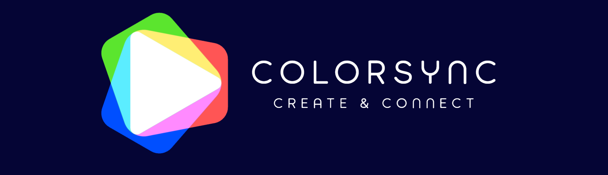

This is **ColorSync**, a collaborative art platform built as part of a school assignment.  
It allows artists to draw together in real time, save work locally, and sync with the platform's backend.

For full documentation and setup instructions, check out the [Wiki](https://github.com/TanyasiPills/ColorSync/wiki)

## Installation
### Desktop
Using the git repository source code and not installing via the installers or through the website you need the following steps:

#### Step 1: Downloading the repository
```
git clone https://github.com/TanyasiPills/ColorSync.git  
```
&nbsp;&nbsp;&nbsp;&nbsp; For only the desktop version, you can use:
```
git clone -b Desktop https://github.com/TanyasiPills/ColorSync.git  
```

#### Step 2: Opening the solution in Visual studio
&nbsp;&nbsp;&nbsp;&nbsp; All widely used Visual Studio version are supported

#### Step 3: Build & Run
&nbsp;&nbsp;&nbsp;&nbsp; From the solution, you can build and run the program itself, or the program with the installer, creating an msi file to install

### Setup
In the settings menu(development menu), the server ip should be set to the ip of the server computer  


## License

This project is licensed under the MIT License  
See the [LICENSE](./LICENSE) file for more info!
